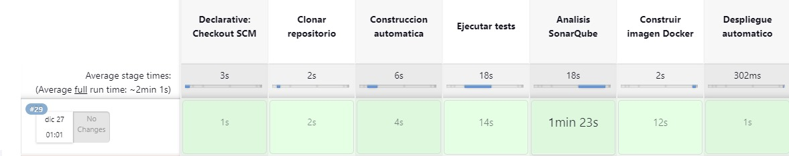
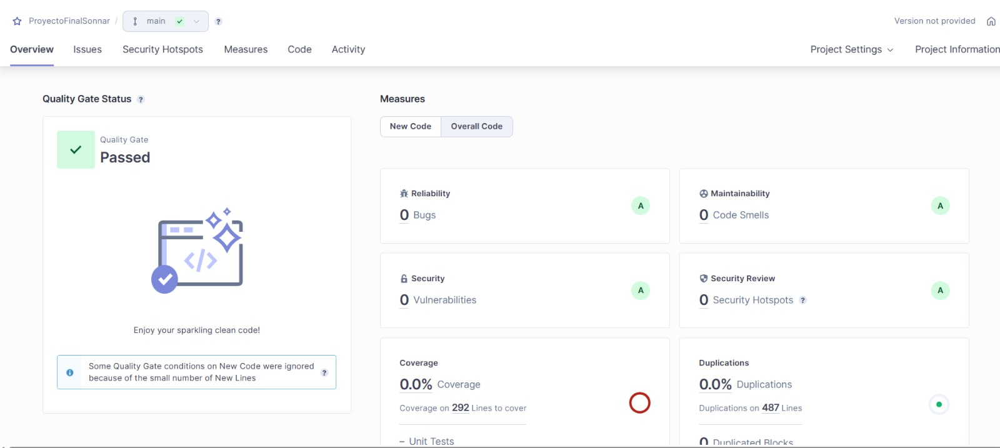
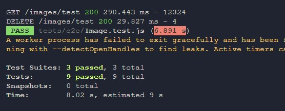

<a name="readme-top"></a>
[![Contributors][contributors-shield]][contributors-url]
[![Forks][forks-shield]][forks-url]

<br />
<div align="center">
  <a href="https://github.com/juanhuamani/PROYECTO-FINAL">
    
  </a>

  <h3 align="center">PROYECTO FINAL ING. SOFTWARE II</h3>

  <p align="center">
    Nuestro proyecto es una aplicación web para compartir imágenes, comentarios y más.  Esta aplicación proporciona una plataforma para que los usuarios carguen imágenes, dejen comentarios y participen en interacciones sociales en torno a esas imágenes.
    <br />
    <a href="https://www.canva.com/design/DAF4GPKP4x0/q1nQ4JNAXnmcMoyasE0D4Q/edit?utm_content=DAF4GPKP4x0&utm_campaign=designshare&utm_medium=link2&utm_source=sharebutton"><strong>Diapositivas»    </strong></a>
    <a href="https://trello.com/invite/b/bnAgQJZB/ATTIa2cb4bf74f8918d345b818378c514375320D2B47/proyecto-final-is-ii"><strong>Trello»</strong></a>
    <br />
  </p>
</div>

# Objetivo del Proyecto
El objetivo principal de este proyecto es crear una plataforma interactiva y amigable para que los usuarios compartan imágenes y participen en conversaciones significativas a través de comentarios. La aplicación debe permitir a los usuarios registrarse, cargar imágenes, dejar comentarios en las imágenes de otros usuarios y expresar interacción social a través de funciones adicionales, como la opción de "me gusta" o compartir.

## CONSTRUIDO CON:
Se empleo los siguientes frameworks y dependencias:
* [![Node][Node.js]][Node-url]
* [![Handlebars][Handlebars]][Handlebars-url]
* [![Bootstrap][Bootstrap.com]][Bootstrap-url]
* [![Express][Express]][Express-url]
## Características Específicas

### Registro de Usuarios

- Desarrollar un sistema que permita el registro de usuarios con un proceso de autenticación seguro para la confianza de los mismos.
- Proporcionar perfiles de usuario que muestren las imágenes subidas y los comentarios dejados por ese usuario.

### Carga de Imágenes

- Permitir que los usuarios suban imágenes acompañadas de títulos descriptivos.
- Validar y procesar las imágenes cargadas para garantizar la integridad y seguridad del sistema.

### Comentarios

- Habilitar la función de comentarios en las imágenes, permitiendo a los usuarios dejar sus opiniones y respuestas que deseen.
- Incluir opciones de edición y eliminación de comentarios para los usuarios que los han dejado.

### Interacción Social

- Implementar la opción de "me gusta" en las imágenes para que los usuarios puedan expresar su aprecio hacia las mismas.
- Facilitar la posibilidad de compartir fotos en distintas redes sociales.

### Diseño Responsivo

- Asegurarse de que la aplicación sea accesible y tenga un diseño responsivo para adaptarse a diferentes dispositivos y tamaños de pantalla.

### Seguridad

- Implementar medidas de seguridad para proteger la privacidad de los usuarios y prevenir posibles vulnerabilidades.

### Despliegue con Docker

- Garantizar que la aplicación se pueda implementar fácilmente utilizando Docker para simplificar el proceso de despliegue.

# Variables de entorno

- `MONGODB_URI`, the mongodb database uri.
- `PORT` the http server port. By default is `3000`.


# Estructura de Proyecto

- **`src` - Código Fuente:**
  - `index.js` o `app.js`: Punto de entrada principal de la aplicación.
  - **Rutas (`routes`):** Carpeta que contiene archivos que definen las rutas y controladores de la aplicación.
  - **Controladores (`controllers`):** Carpeta que contiene lógica de controladores para manejar las solicitudes HTTP.
  - **Modelos (`models`):** Carpeta que puede contener definiciones de modelos si se utiliza una base de datos (por ejemplo, con Mongoose para MongoDB).
  - `database.js`: Archivo que configura y establece la conexión con la base de datos.

- **`public` - Recursos Estáticos:**
  - `img`: Carpeta que podría contener imágenes utilizadas en la aplicación.
  - `css`: Carpeta que podría contener archivos CSS para estilos.
  - `js`: Carpeta que podría contener archivos JavaScript para lógica del lado del cliente.

- **`config` - Configuraciones:**
  - `config.js` o archivos similares: Archivos que contiene configuraciones generales para la aplicación.

- **`views` - Vistas :**
  - Carpeta que contiene archivos de vistas usando un motor de plantillas como EJS o Handlebars.

- **`node_modules` - Dependencias de Node.js:**
  - Carpeta que contiene todas las dependencias instaladas mediante npm.

- **`docker-compose.yml` - Configuración de Docker Compose:**
  - Archivo que describe la configuración de los contenedores Docker utilizados para la aplicación y la base de datos.

- **`Dockerfile` - Configuración de Docker:**
  - Archivo que describe cómo se construirá la imagen del contenedor Docker para la aplicación.

- **`sonar-scanner.properties` - Configuración de SonarScanner:**
  - Archivo que puede contener configuraciones específicas para SonarScanner, que se utiliza para análisis estático del código.
    
# Pasos Automatizados

- **Clonación del Proyecto:**
   - Jenkins clona automáticamente el repositorio antes de cada despliegue.

- **Construcción:**
   - La construcción del proyecto se realiza automáticamente utilizando Jenkins.

- **Pruebas (JTest, Selenium):**
   - Se ejecutan pruebas automatizadas utilizando JTest y Selenium.
   - Escenarios de prueba que incluyen funcionalidades como acceso a URL principal, subida/eliminación de imágenes, creación de imágenes y likes.

- **Análisis Estático con SonarQube:**
   - Se utiliza el plugin de SonarQube en Jenkins para analizar el código.
   - Configuración de SonarQube en Jenkins con credenciales específicas.
   - Integración del análisis en el pipeline, declarando el nombre del proyecto.

- **Despliegue con Docker:**
   - Se implementa la automatización del despliegue utilizando Docker.
   - El Dockerfile y docker-compose.yml están configurados para asegurar la escalabilidad y la gestión de dependencias.

### Automatización con Jenkins
Hemos implementado un robusto proceso de automatización utilizando Jenkins para simplificar y mejorar nuestro ciclo de vida de desarrollo. A continuación, se muestra el script de la automatizacion en nuestro pipeline:

 ```
   stages {
        stage('Clonar repositorio') {
            steps {
                git 'https://github.com/juanhuamani/PROYECTO-FINAL.git'
            }
        }

         stage('Construccion automatica') {
            steps {
                script {
                    if (isUnix()) {sh 'npm install'}
                    else {bat 'npm install'}
                }
            }
        }
```
### Ejecución  de Jenkins
<a href="https://github.com/juanhuamani/PROYECTO-FINAL">
    
  </a>

# Analisis Estatico

## SonarQube

  Se emplea SonarQube para una evaluación exhaustiva de la calidad del código, destacando áreas de mejora según los principios SOLID y pautas de "clean code".
- **Métricas Adicionales:**
  - Complejidad Ciclomática: Se evalúa la complejidad del código para identificar posibles puntos de refactorización.
- **Acoplamiento entre Clases:**
  - Se analiza la dependencia entre clases para garantizar un diseño modular y desacoplado.
- **Duplicación de Código:**
  - Se identifican fragmentos duplicados para promover la reutilización y mantener un código más limpio.
 
### Pruebas SonarQube
<a href="https://github.com/juanhuamani/PROYECTO-FINAL">
    
  </a>

### Integración de SonarQube en Jenkins
Para integrar SonarQube en Jenkins, necesitas configurar el análisis del código con el servidor SonarQube. Aquí el codigo para configurar el bloque de análisis de SonarQube en el pipeline de Jenkins:


```
stage('Analisis SonarQube') {
            steps {
                script {
                    withSonarQubeEnv('SonnarScannerQube') {
                        bat 'sonar-scanner -Dsonar.projectKey=ProyectoFinalSonnar'
                    }
                }
            }
        }
```

# Pruebas

## Pruebas Unitarias y de Integración con JTest y Supertest
Hemos implementado pruebas exhaustivas utilizando JTest y Supertest para asegurar la calidad y robustez de nuestro código. Estas pruebas abarcan escenarios clave que incluyen operaciones funcionales y casos de uso específicos de nuestra aplicación.

### Escenarios de Prueba

- **Gets Funcionales - Casos de Prueba:**
  - Verificamos la funcionalidad de los endpoints GET mediante casos de prueba diseñados para garantizar el acceso correcto a la URL principal y la recuperación de datos esencial.
- **Comprobar Acceso a URL Principal:**
  - Confirmamos que la URL principal de la aplicación es accesible y responde correctamente.
- **Subida y Eliminación de Imágenes y Posts:**
  - Evaluamos la capacidad de nuestro sistema para manejar la carga y eliminación de imágenes y posts, verificando la integridad y consistencia de los datos.
- **Funciones en Imágenes - Casos de Prueba:**
  - Realizamos pruebas específicas para las funciones relacionadas con las imágenes, incluyendo la creación de imágenes y la aplicación de likes.
- **Creación de Imagen y Like:**
  - Verificamos la creación exitosa de una imagen y la capacidad del sistema para gestionar la funcionalidad de "me gusta" asociada.
- **Sobrecarga de Likes Soportada por el Servidor:**
  - Probamos el rendimiento del servidor al simular una sobrecarga de "me gusta", asegurándonos de que la aplicación pueda manejar la carga de manera eficiente.
    
### Archivos de Pruebas

Los casos de prueba están implementados en los siguientes archivos:

- **test/index.spec.js:**
  -  Contiene pruebas relacionadas con el acceso a la URL principal y la funcionalidad de los endpoints GET.
- **test/imageControl.spec.js:**
  -  Incluye pruebas específicas para las funciones de control de imágenes, como la creación y eliminación, así como la gestión de likes.
    
### Pruebas Jtest
<a href="https://github.com/juanhuamani/PROYECTO-FINAL">
    
  </a>

### Integración en Jenkins
Hemos integrado estas pruebas en nuestro pipeline de Jenkins para garantizar una evaluación continua de la funcionalidad y rendimiento de la aplicación.

- **Configuración en Jenkins**
  - Dentro del pipeline de Jenkins, hemos agregado una etapa específica para la ejecución de las pruebas utilizando el siguiente script:

```
stage('Ejecutar tests') {
        steps {
            script {
                if (isUnix()) {sh 'npm test'}
                else {bat 'npm test'}
            }
        }
    }
```
   
## Pueba de Rendimiento Jmeter

Para llevar a cabo las pruebas de rendimiento, se configuró JMeter para simular 100 usuarios virtuales, cada uno realizando las siguientes acciones:

- **Obtener Imágenes:**
  - Se evalúa el tiempo de respuesta al acceder y cargar la lista de imágenes disponibles en la aplicación.
- **Dar Me Gusta a una Imagen:**
  - Se simula la interacción de usuarios que dan "me gusta" a una imagen específica, evaluando la eficiencia en tiempo de respuesta de esta acción.
- **Comentar una Imagen:**
  - Se verifica el rendimiento al realizar la acción de comentar en una imagen, simulando la interacción típica de usuarios que participan activamente en la plataforma.

### Configuración del Job en Jenkins:
Dentro del pipeline de Jenkins, hemos agregado una etapa específica para las pruebas de rendimiento utilizando un script que ejecuta las pruebas de JMeter.

```
tage('JMeter tests') {
            steps {
                script {
                    if (isUnix()) {
                        sh 'jmeter -n -t ./tests/jmeter/test.jmx -l result.csv'
                        perfReport 'result.csv'
                    } else {
                        bat 'jmeter -n -t path\\to\\your\\test.jmx -l testresults.jtl'
                    }
                }
            }
        }
```

## Pruebas con Selenium
Hemos implementado pruebas automatizadas utilizando Selenium para validar las funcionalidades críticas de nuestra aplicación. Las pruebas se centran en escenarios de uso común, asegurando que las acciones clave sean funcionales y proporcionen una experiencia de usuario coherente.

- **Subir Imagen:**
  - Automatizamos el proceso de carga de imágenes para garantizar que los usuarios puedan subir archivos de manera eficiente. Las pruebas validan la interfaz de carga, la correcta visualización de la imagen y la persistencia en la base de datos.
- **Dar Me Gusta a una Imagen:**
  - Utilizando Selenium, hemos automatizado la acción de dar "me gusta" a una imagen. Las pruebas verifican la actualización dinámica de la interfaz de usuario y la consistencia de los datos almacenados.
- **Comentar Imagen:**
  - Automatizamos el proceso de comentar en una imagen, asegurándonos de que los comentarios se registren correctamente y se presenten adecuadamente en la interfaz de usuario.
- **Eliminar Imagen:**
  - Validamos la funcionalidad de eliminación de imágenes mediante pruebas automatizadas con Selenium. Estas pruebas aseguran que el sistema maneje correctamente la eliminación de imágenes y actualice la interfaz y la base de datos de acuerdo.
 
### Integración en Jenkins
Estas pruebas de Selenium se han integrado en nuestro pipeline de Jenkins para ejecutarse automáticamente en cada ciclo de entrega.

- **Configuración en Jenkins**

  - Dentro del pipeline de Jenkins, hemos agregado una etapa específica para la ejecución de pruebas de Selenium:
    
 ```
 stage('Ejecutar tests') {
        steps {
            script {
                if (isUnix()) {sh 'npm test'}
                else {bat 'npm test'}
            }
        }
    }
 ```
## Integración de OWASP Dependency Check en Jenkins
Para fortalecer la seguridad del proyecto, hemos integrado OWASP Dependency Check en nuestro pipeline de Jenkins. Esta herramienta automatiza la identificación de vulnerabilidades en las dependencias del proyecto, proporcionando una capa adicional de seguridad durante el proceso de desarrollo.

### Pasos para la Integración

- **Instalación de OWASP Dependency Check en el Servidor de Jenkins:**
  - Asegúrate de que OWASP Dependency Check esté instalado en el servidor de Jenkins. Puedes seguir la documentación oficial para realizar la instalación: OWASP Dependency Check Installation.
### Configuración en Jenkins:
Agregamos la tarea de OWASP Dependency Check al pipeline de Jenkins para ejecutar automáticamente la verificación de vulnerabilidades en las dependencias del proyecto.
    
```
stage('OWASP Dependency-Check Vulnerabilities') {
          steps {
            dependencyCheck additionalArguments: ''' 
                        -o './'
                        -s './'
                        -f 'ALL' 
                        --prettyPrint''', odcInstallation: 'OWASP Dependency-Check Vulnerabilities'
            
            dependencyCheckPublisher pattern: 'dependency-check-report.xml'
          }
        }
```

## Despliegue DOCKER
### DOCKER-COMPOSE.YML:
Hemos diseñado un archivo docker-compose.yml para orquestar nuestros servicios de manera eficiente en un entorno Docker. A continuación, se describen los componentes clave de esta configuración:

#### Servicios Configurados

El archivo docker-compose.yml se encarga de dos servicios fundamentales: web y mongo.

- **Servicio Web:**
  - Este servicio utiliza un contenedor con Node.js y expone el puerto 3000 para interactuar con nuestra aplicación. Además, establece una conexión con el servicio de MongoDB para garantizar una comunicación efectiva.
- **Servicio MongoDB:**
  - Configuramos un servicio de MongoDB para proporcionar la base de datos necesaria para el correcto funcionamiento de nuestra aplicación.

### FRAGMENTO DEL DOCKERFILE:

- Basado en la imagen oficial de Node.js versión 20.9.
- Establece el directorio de trabajo en /usr/src/app.
- Copia los archivos package.json y package-lock.json y ejecuta npm install para instalar dependencias.
- Instala globalmente nodemon para facilitar el desarrollo.
- Copia el resto de los archivos al contenedor.
- Expone el puerto 3000.
- Configura el comando de inicio para ejecutar el script dev definido en package.json.

### Integración en Jenkins
Este archivo docker-compose.yml también ha sido integrado en nuestro pipeline de Jenkins para facilitar la implementación y el despliegue automáticos de nuestros servicios en entornos controlados.

### Configuración en Jenkins

Dentro del pipeline de Jenkins, hemos agregado una etapa específica para la ejecución del archivo docker-compose.yml:

```
stage('Construir imagen Docker') {
            steps {
                script {
                    if (isUnix()) {sh 'docker build -t proyecto-final .'}
                    else {bat 'docker build -t proyecto-final .'}
                }
            }
        }

        stage('Despliegue automatico') {
            steps {
                script {
                    if (isUnix()) {sh 'docker-compose up -d'}
                    else {bat 'docker-compose up -d'}
                }
            }
        }
```

# Instalación

## Instalación rápida

```
git clone https://github.com/juanhuamani/PROYECTO-FINAL
cd PROYECTO-FINAL
npm install
npm run dev
```

## Intalación con docker-compose (Recomendado)

```
docker-compose up
```
# Links 

## Link de Trello

```
https://trello.com/invite/b/bnAgQJZB/ATTIa2cb4bf74f8918d345b818378c514375320D2B47/proyecto-final-is-ii
```

## Link de las Diapositivas

```
https://www.canva.com/design/DAF4GPKP4x0/q1nQ4JNAXnmcMoyasE0D4Q/edit?utm_content=DAF4GPKP4x0&utm_campaign=designshare&utm_medium=link2&utm_source=sharebutton
```


<!-- MARKDOWN LINKS & IMAGES -->
<!-- https://www.markdownguide.org/basic-syntax/#reference-style-links -->
[contributors-shield]: https://img.shields.io/github/contributors/othneildrew/Best-README-Template.svg?style=for-the-badge
[contributors-url]: https://github.com/juanhuamani/PROYECTO-FINAL/graphs/contributors
[forks-shield]: https://img.shields.io/github/forks/othneildrew/Best-README-Template.svg?style=for-the-badge
[forks-url]: https://github.com/juanhuamani/PROYECTO-FINAL/network/members


[Node.js]: https://img.shields.io/badge/node.js-287236?style=for-the-badge&logo=nextdotjs&logoColor=white
[Node-url]: https://nodejs.org/en/
[Handlebars]: https://img.shields.io/badge/Handlebars-20232A?style=for-the-badge&logo=react&logoColor=61DAFB
[Handlebars-url]: https://handlebarsjs.com/
[Express]: https://img.shields.io/badge/Express.js-35495E?style=for-the-badge&logo=vuedotjs&logoColor=4FC08D
[Express-url]: https://expressjs.com/
[Bootstrap.com]: https://img.shields.io/badge/Bootstrap-563D7C?style=for-the-badge&logo=bootstrap&logoColor=white
[Bootstrap-url]: https://getbootstrap.com
